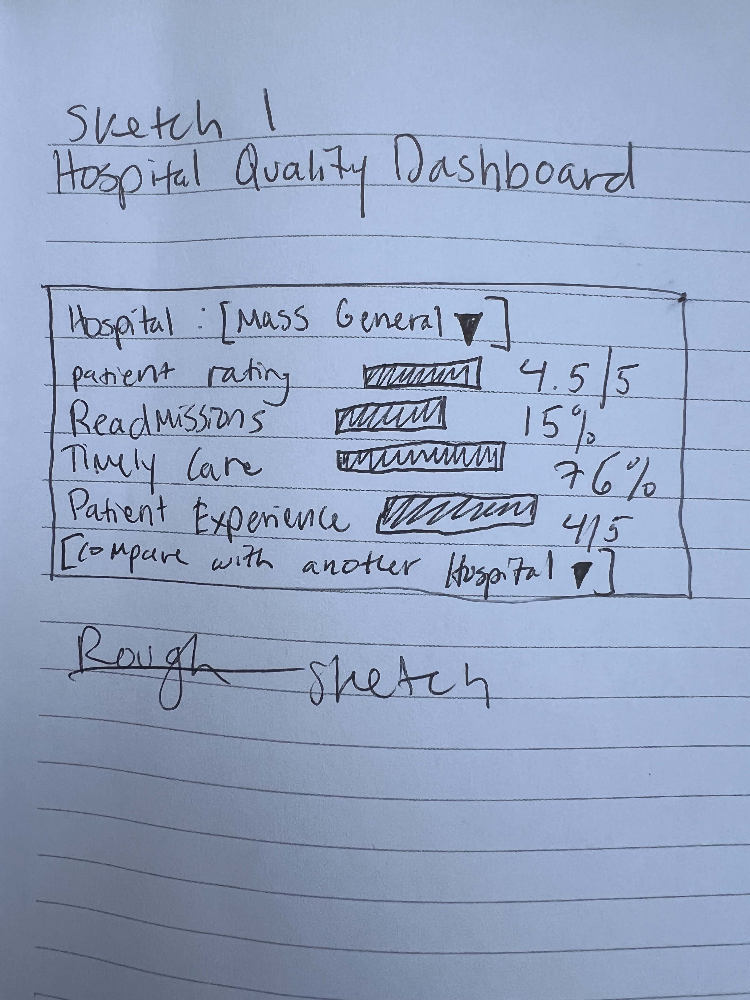
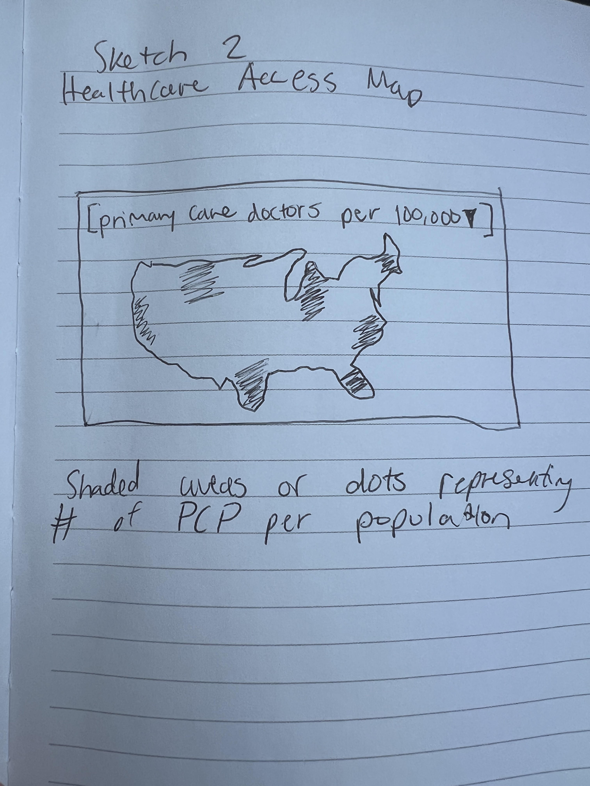
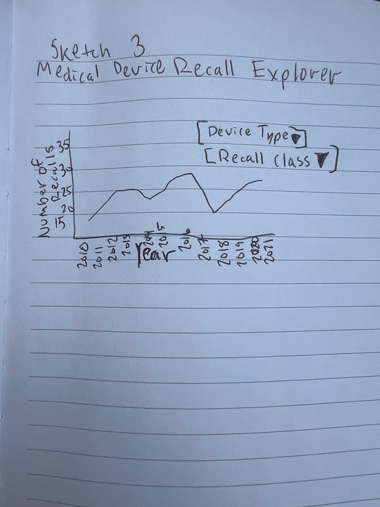
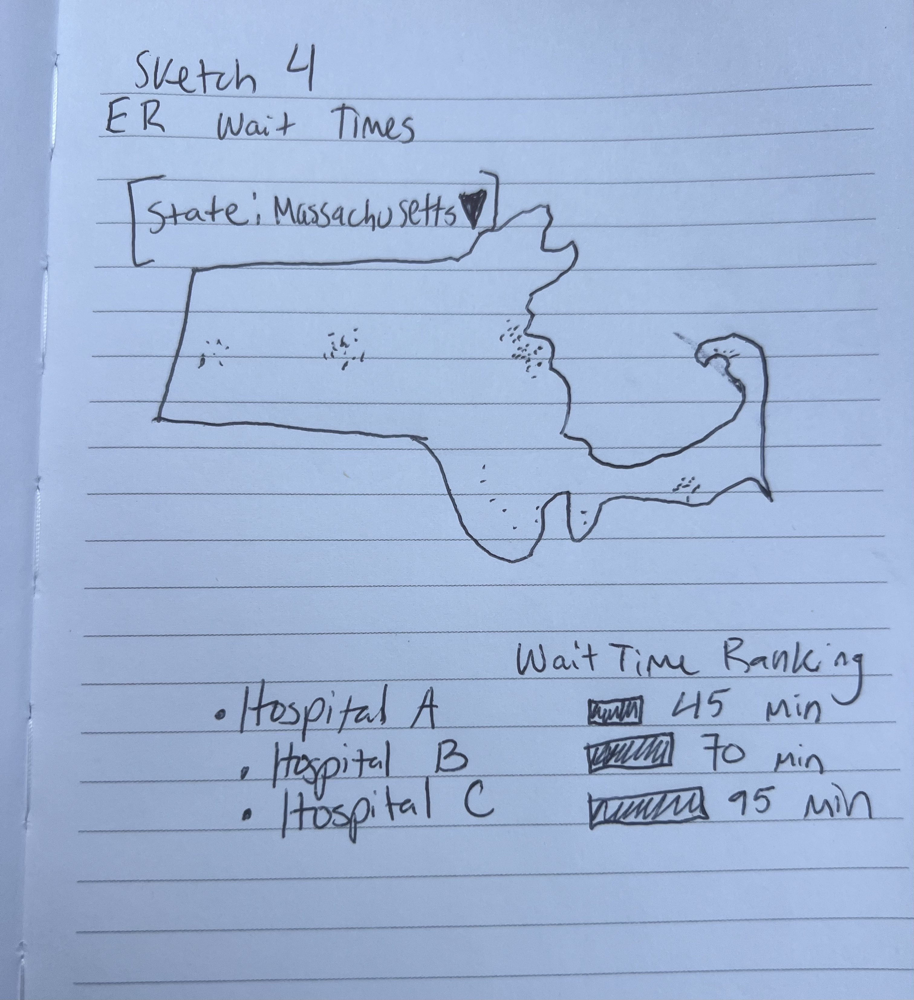

# Final Project Exploration 1

## General Topic: Healthcare Data

For my final project, I am interested in exploring datasets related to healthcare. Healthcare has many opportunities for data visualization because there are large public datasets related to hospital quality and patient experience, healthcare access, medical devices, emergency care, and many more. 

At this stage, I am considering several possible directions and am not yet choosing one specific topic. I am especially interested in using visualization to make healthcare information easier to understand and to identify differences between hospitals, geographic areas, or categories of medical technology.

---

# Idea 1: Hospital Quality and Patient Experience

One area I am interested in exploring is how hospital quality and patient experience vary across hospitals in the United States.

Hospitals are measured using many different indicators, including patient satisfaction, readmissions, complications, timeliness of care, and other quality measures. A visualization could make it easier to compare hospitals and identify which hospitals perform particularly well in certain areas.

## Questions I Could Investigate

- How much does hospital quality vary across different hospitals or states?
- Which hospitals have the highest patient experience ratings? Which have the lowest?
- Are hospitals with better patient experience ratings also associated with better quality measures?
- Are there geographic patterns in hospital quality?
- How do patient ratings compare with measures like readmissions or timely care?
- Are there differences between hospitals in urban and rural areas?

## Potential Datasets

### CMS Provider Data Catalog – Hospitals

https://data.cms.gov/provider-data/topics/hospitals

The Centers for Medicare & Medicaid Services publishes public data for thousands of Medicare-certified hospitals in the United States.

The available datasets include information related to:

- Patient experience
- Hospital ratings
- Readmissions
- Timely and effective care
- Complications
- Hospital characteristics
- Geographic location

### HCAHPS Patient Survey Data

https://data.cms.gov/provider-data/topics/hospitals

The Hospital Consumer Assessment of Healthcare Providers and Systems (HCAHPS) survey contains information about patients' experiences during hospital stays.

Possible measures include communication with doctors and nurses, hospital cleanliness, responsiveness of hospital staff, and overall hospital ratings.

## Related Data Examples

### Medicare Care Compare

https://www.medicare.gov/care-compare/

Medicare Care Compare allows users to search for hospitals and compare different quality measures.

### CMS Provider Data

https://data.cms.gov/provider-data/

The CMS data portal provides downloadable healthcare quality datasets that could be used to build more customized visualizations.

### Peterson-KFF Health System Tracker

https://www.healthsystemtracker.org/

The Health System Tracker contains examples of healthcare visualizations related to quality, cost, access, and patient outcomes.

## Sketch 1: Hospital Quality Comparison Dashboard

For this sketch, I imagine a dashboard where a user could select a hospital and see several different measures of hospital quality. 

The dashboard could contain horizontal bar charts showing measures such as patient rating, readmission performance, timeliness of care, and other quality measures.

The user could also select two hospitals to compare them side-by-side. This could help show that one hospital may perform very well in one category but not as well in another.

The point of the sketch is to show "What if a user could choose a hospital and see several quality measures all at once." 

---

# Idea 2: Healthcare Access Across the United States

Another topic I am interested in exploring is healthcare access and how easy or difficult it is for people in different parts of the United States to obtain medical care.

Access to healthcare can depend on geographic location, the number of healthcare providers available, insurance coverage, and whether someone lives in an urban or rural area.

A visualization could help identify areas where healthcare resources are limited.

## Questions I Could Investigate

- Which areas of the United States have the greatest access to healthcare providers?
- Which areas appear to be underserved?
- How does healthcare access differ between rural and urban areas?
- How does the number of doctors or healthcare facilities per person vary geographically?
- Are there states with particularly high or low levels of healthcare access?
- Are there areas where people may need to travel long distances to reach a hospital or healthcare provider?

## Potential Datasets

### Health Resources and Services Administration

https://data.hrsa.gov/

The Health Resources and Services Administration provides public datasets related to healthcare facilities, healthcare workforce distribution, and areas with shortages of healthcare professionals.

Potential variables could include:

- Number of physicians
- Healthcare facilities
- Primary care providers
- Geographic location
- Health Professional Shortage Areas

### Area Health Resources Files

https://data.hrsa.gov/topics/health-workforce/ahrf

The Area Health Resources Files contain county-level information about healthcare resources, healthcare professionals, demographics, and population characteristics.

## Related Data Examples

### HRSA Data Warehouse

https://data.hrsa.gov/

HRSA provides interactive maps and dashboards showing healthcare facilities and areas with healthcare provider shortages.

## Sketch 2: Healthcare Access Map

For this sketch, I imagine an interactive map of the United States showing healthcare access by county or state.

Areas could be shaded based on a measure such as the number of primary care physicians per population.

The user could select different measures using a dropdown menu, such as primary care doctors, hospitals, insurance coverage, or healthcare shortage designations.

Hovering over an area could display additional information about the county or state.

This visualization could make it easier to identify geographic areas where healthcare resources are limited.

---

# Idea 3: Medical Device Safety and FDA Data

Another topic I am interested in is medical device safety.

Medical devices range from relatively simple products to complex devices such as patient monitors, infusion pumps, surgical equipment, and implanted devices.

The FDA maintains public databases containing information about medical device recalls, adverse events, and other safety information. I think this could provide an interesting way to investigate trends in medical technology and device safety.

## Questions I Could Investigate

- What types of medical devices are recalled most frequently?
- How has the number of medical device recalls changed over time?
- Which medical specialties or device categories have the most recalls?
- What are the most common reasons that medical devices are recalled?
- How many recalls are classified as higher-risk versus lower-risk?
- Are certain manufacturers associated with more recalls?
- Are there periods where recalls increased significantly?
- Which types of devices appear most frequently in adverse-event reports?

## Potential Datasets

### FDA Medical Device Recalls

https://www.fda.gov/medical-devices/medical-device-recalls

The FDA publishes information about medical device recalls, including information about the product, manufacturer, reason for the recall, and recall classification.

### openFDA Device Recall API

https://open.fda.gov/apis/device/recall/

The openFDA API provides structured medical device recall data that could potentially be downloaded and converted into a JSON or CSV dataset.

Possible fields include:

- Recall date
- Manufacturer
- Product description
- Recall classification
- Reason for recall
- Product code
- Recall status

### FDA MAUDE Database

https://www.accessdata.fda.gov/scripts/cdrh/cfdocs/cfmaude/search.cfm

The Manufacturer and User Facility Device Experience (MAUDE) database contains reports involving medical device adverse events.

This dataset could potentially allow exploration of device problems, injuries, malfunctions, and other reported events.

## Sketch 3: Medical Device Recall Explorer

For this sketch, I imagine a visualization showing medical device recalls over time.

The main visualization could be a line chart or bar chart showing the number of recalls each year.

The user could filter the visualization by device category, manufacturer, or recall classification.

Below the chart, there could be a ranked list showing the device categories or manufacturers associated with the most recalls.

Another possibility would be to use different symbols or groups to distinguish between different recall classifications.

This visualization could help show changes in medical device safety trends over time and show which types of devices are most commonly affected.

---

# Idea 4: Emergency Department Wait Times

Another healthcare topic I am interested in exploring is emergency department wait times and how they vary between hospitals and geographic areas.

Emergency departments can experience very different levels of demand, and patients may spend significantly different amounts of time waiting for care depending on the hospital they visit.

A visualization could help compare hospitals and identify geographic patterns in emergency department performance.

## Questions I Could Investigate

- Which hospitals have the shortest and longest emergency department wait times?
- How much do emergency department wait times vary between hospitals?
- How do wait times vary by state or region?
- Are emergency department wait times longer in certain geographic areas?
- Are urban emergency departments associated with longer waits than rural emergency departments?
- Do hospitals with better patient ratings also tend to have shorter emergency department wait times?
- Is there a relationship between hospital size and emergency department wait time?
- How have emergency department wait times changed over time?

## Potential Datasets

### CMS Provider Data Catalog – Hospitals

https://data.cms.gov/provider-data/topics/hospitals

CMS publishes hospital-level measures related to emergency department performance and timely and effective care.

Possible measures include:

- Time spent in the emergency department
- Time before patients are admitted to the hospital
- Timeliness of emergency department care
- Hospital location
- Hospital characteristics

### CMS Timely and Effective Care Data

https://data.cms.gov/provider-data/topics/hospitals

CMS's hospital datasets include measures that could potentially be used to compare emergency department performance between hospitals.

## Sketch 4: Emergency Department Wait Time Map and Ranking

For this sketch, I imagine a map showing hospitals across the United States.

Each hospital could be represented by a point, with the point representing the hospital's emergency department wait time.

A user could select a state or geographic area and see nearby hospitals.

Next to the map, there could be a ranked bar chart showing hospitals from shortest to longest emergency department wait time.

The user could click on a hospital to see additional information such as its location, patient rating, and other quality measures.

This combination of a map and ranking chart could make it easier to see both geographic patterns and differences between individual hospitals.

---

# Current Thoughts

At this stage, I am interested in all four of these healthcare topics.

The **hospital quality and patient experience** idea interests me because there are many different measures that could be combined to give a more complete picture of hospital performance.

The **healthcare access** idea could lead to a strong geographic visualizations showing differences between communities and identifying areas where healthcare resources are limited.

The **medical device safety** idea interests me because it combines healthcare with technology and engineering. FDA recall data could provide an opportunity to investigate how device safety issues vary between device categories and change over time.

The **emergency department wait time** idea is also interesting to me because wait time is an easy measure to understand and could work well with both maps and hospital comparison visualizations.

For future project exploration, I would like to investigate the available datasets more closely, determine which datasets provide the most useful and complete data, and think about which topic offers the strongest opportunities for an interactive visualization.