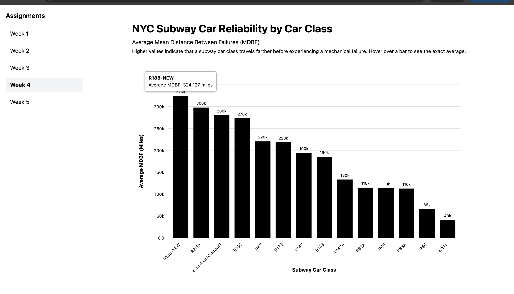
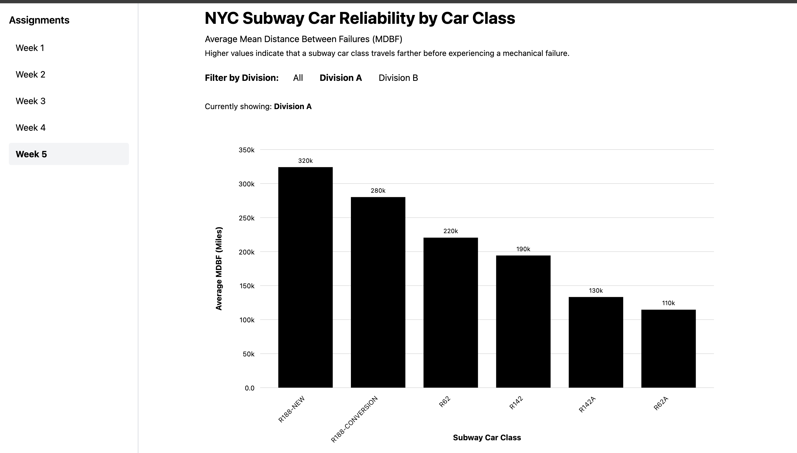
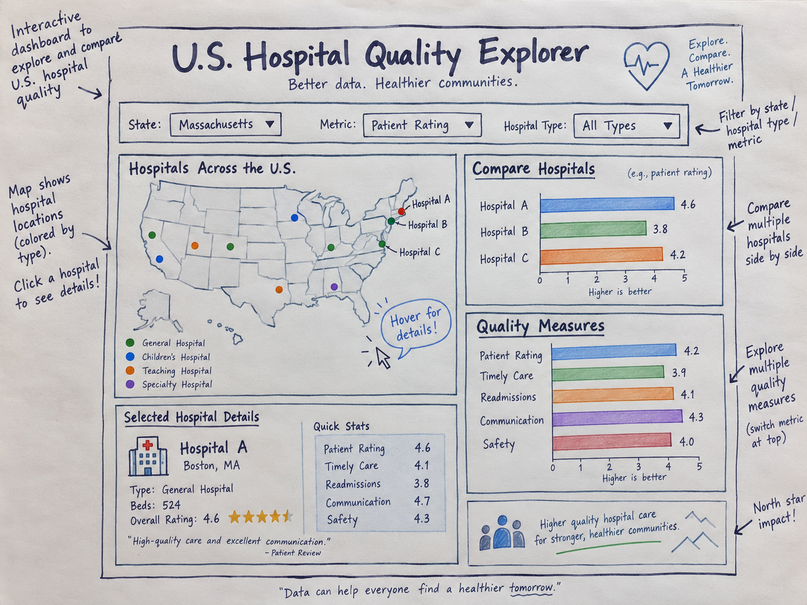
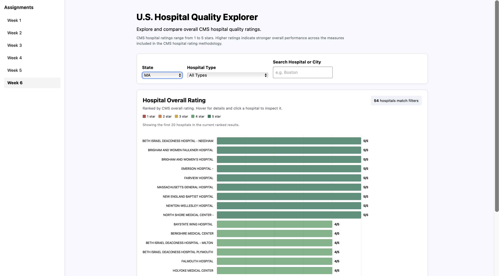

# Final Project Exploration 1

## General Topic: Healthcare Data

For my final project, I am interested in exploring datasets related to healthcare. Healthcare has many opportunities for data visualization because there are large public datasets related to hospital quality and patient experience, healthcare access, medical devices, emergency care, and many more. 

At this stage, I am considering several possible directions and am not yet choosing one specific topic. I am especially interested in using visualization to make healthcare information easier to understand and to identify differences between hospitals, geographic areas, or categories of medical technology.

---

# Idea 1: Hospital Quality and Patient Experience

One area I am interested in exploring is how hospital quality and patient experience vary across hospitals in the United States.

Hospitals are measured using many different indicators, including patient satisfaction, readmissions, complications, timeliness of care, and other quality measures. A visualization could make it easier to compare hospitals and identify which hospitals perform particularly well in certain areas.

## Questions I Could Investigate

- How much does hospital quality vary across different hospitals or states?
- Which hospitals have the highest patient experience ratings? Which have the lowest?
- Are hospitals with better patient experience ratings also associated with better quality measures?
- Are there geographic patterns in hospital quality?
- How do patient ratings compare with measures like readmissions or timely care?
- Are there differences between hospitals in urban and rural areas?

## Potential Datasets

### CMS Provider Data Catalog – Hospitals

https://data.cms.gov/provider-data/topics/hospitals

The Centers for Medicare & Medicaid Services publishes public data for thousands of Medicare-certified hospitals in the United States.

The available datasets include information related to:

- Patient experience
- Hospital ratings
- Readmissions
- Timely and effective care
- Complications
- Hospital characteristics
- Geographic location

### HCAHPS Patient Survey Data

https://data.cms.gov/provider-data/topics/hospitals

The Hospital Consumer Assessment of Healthcare Providers and Systems (HCAHPS) survey contains information about patients' experiences during hospital stays.

Possible measures include communication with doctors and nurses, hospital cleanliness, responsiveness of hospital staff, and overall hospital ratings.

## Related Data Examples

### Medicare Care Compare

https://www.medicare.gov/care-compare/

Medicare Care Compare allows users to search for hospitals and compare different quality measures.

### CMS Provider Data

https://data.cms.gov/provider-data/

The CMS data portal provides downloadable healthcare quality datasets that could be used to build more customized visualizations.

### Peterson-KFF Health System Tracker

https://www.healthsystemtracker.org/

The Health System Tracker contains examples of healthcare visualizations related to quality, cost, access, and patient outcomes.

## Sketch 1: Hospital Quality Comparison Dashboard

For this sketch, I imagine a dashboard where a user could select a hospital and see several different measures of hospital quality. 

The dashboard could contain horizontal bar charts showing measures such as patient rating, readmission performance, timeliness of care, and other quality measures.

The user could also select two hospitals to compare them side-by-side. This could help show that one hospital may perform very well in one category but not as well in another.

The point of the sketch is to show "What if a user could choose a hospital and see several quality measures all at once." 

---

# Idea 2: Healthcare Access Across the United States

Another topic I am interested in exploring is healthcare access and how easy or difficult it is for people in different parts of the United States to obtain medical care.

Access to healthcare can depend on geographic location, the number of healthcare providers available, insurance coverage, and whether someone lives in an urban or rural area.

A visualization could help identify areas where healthcare resources are limited.

## Questions I Could Investigate

- Which areas of the United States have the greatest access to healthcare providers?
- Which areas appear to be underserved?
- How does healthcare access differ between rural and urban areas?
- How does the number of doctors or healthcare facilities per person vary geographically?
- Are there states with particularly high or low levels of healthcare access?
- Are there areas where people may need to travel long distances to reach a hospital or healthcare provider?

## Potential Datasets

### Health Resources and Services Administration

https://data.hrsa.gov/

The Health Resources and Services Administration provides public datasets related to healthcare facilities, healthcare workforce distribution, and areas with shortages of healthcare professionals.

Potential variables could include:

- Number of physicians
- Healthcare facilities
- Primary care providers
- Geographic location
- Health Professional Shortage Areas

### Area Health Resources Files

https://data.hrsa.gov/topics/health-workforce/ahrf

The Area Health Resources Files contain county-level information about healthcare resources, healthcare professionals, demographics, and population characteristics.

## Related Data Examples

### HRSA Data Warehouse

https://data.hrsa.gov/

HRSA provides interactive maps and dashboards showing healthcare facilities and areas with healthcare provider shortages.

## Sketch 2: Healthcare Access Map

For this sketch, I imagine an interactive map of the United States showing healthcare access by county or state.

Areas could be shaded based on a measure such as the number of primary care physicians per population.

The user could select different measures using a dropdown menu, such as primary care doctors, hospitals, insurance coverage, or healthcare shortage designations.

Hovering over an area could display additional information about the county or state.

This visualization could make it easier to identify geographic areas where healthcare resources are limited.

---

# Idea 3: Medical Device Safety and FDA Data

Another topic I am interested in is medical device safety.

Medical devices range from relatively simple products to complex devices such as patient monitors, infusion pumps, surgical equipment, and implanted devices.

The FDA maintains public databases containing information about medical device recalls, adverse events, and other safety information. I think this could provide an interesting way to investigate trends in medical technology and device safety.

## Questions I Could Investigate

- What types of medical devices are recalled most frequently?
- How has the number of medical device recalls changed over time?
- Which medical specialties or device categories have the most recalls?
- What are the most common reasons that medical devices are recalled?
- How many recalls are classified as higher-risk versus lower-risk?
- Are certain manufacturers associated with more recalls?
- Are there periods where recalls increased significantly?
- Which types of devices appear most frequently in adverse-event reports?

## Potential Datasets

### FDA Medical Device Recalls

https://www.fda.gov/medical-devices/medical-device-recalls

The FDA publishes information about medical device recalls, including information about the product, manufacturer, reason for the recall, and recall classification.

### openFDA Device Recall API

https://open.fda.gov/apis/device/recall/

The openFDA API provides structured medical device recall data that could potentially be downloaded and converted into a JSON or CSV dataset.

Possible fields include:

- Recall date
- Manufacturer
- Product description
- Recall classification
- Reason for recall
- Product code
- Recall status

### FDA MAUDE Database

https://www.accessdata.fda.gov/scripts/cdrh/cfdocs/cfmaude/search.cfm

The Manufacturer and User Facility Device Experience (MAUDE) database contains reports involving medical device adverse events.

This dataset could potentially allow exploration of device problems, injuries, malfunctions, and other reported events.

## Sketch 3: Medical Device Recall Explorer

For this sketch, I imagine a visualization showing medical device recalls over time.

The main visualization could be a line chart or bar chart showing the number of recalls each year.

The user could filter the visualization by device category, manufacturer, or recall classification.

Below the chart, there could be a ranked list showing the device categories or manufacturers associated with the most recalls.

Another possibility would be to use different symbols or groups to distinguish between different recall classifications.

This visualization could help show changes in medical device safety trends over time and show which types of devices are most commonly affected.

---

# Idea 4: Emergency Department Wait Times

Another healthcare topic I am interested in exploring is emergency department wait times and how they vary between hospitals and geographic areas.

Emergency departments can experience very different levels of demand, and patients may spend significantly different amounts of time waiting for care depending on the hospital they visit.

A visualization could help compare hospitals and identify geographic patterns in emergency department performance.

## Questions I Could Investigate

- Which hospitals have the shortest and longest emergency department wait times?
- How much do emergency department wait times vary between hospitals?
- How do wait times vary by state or region?
- Are emergency department wait times longer in certain geographic areas?
- Are urban emergency departments associated with longer waits than rural emergency departments?
- Do hospitals with better patient ratings also tend to have shorter emergency department wait times?
- Is there a relationship between hospital size and emergency department wait time?
- How have emergency department wait times changed over time?

## Potential Datasets

### CMS Provider Data Catalog – Hospitals

https://data.cms.gov/provider-data/topics/hospitals

CMS publishes hospital-level measures related to emergency department performance and timely and effective care.

Possible measures include:

- Time spent in the emergency department
- Time before patients are admitted to the hospital
- Timeliness of emergency department care
- Hospital location
- Hospital characteristics

### CMS Timely and Effective Care Data

https://data.cms.gov/provider-data/topics/hospitals

CMS's hospital datasets include measures that could potentially be used to compare emergency department performance between hospitals.

## Sketch 4: Emergency Department Wait Time Map and Ranking

For this sketch, I imagine a map showing hospitals across the United States.

Each hospital could be represented by a point, with the point representing the hospital's emergency department wait time.

A user could select a state or geographic area and see nearby hospitals.

Next to the map, there could be a ranked bar chart showing hospitals from shortest to longest emergency department wait time.

The user could click on a hospital to see additional information such as its location, patient rating, and other quality measures.

This combination of a map and ranking chart could make it easier to see both geographic patterns and differences between individual hospitals.

---

# Current Thoughts

At this stage, I am interested in all four of these healthcare topics.

The **hospital quality and patient experience** idea interests me because there are many different measures that could be combined to give a more complete picture of hospital performance.

The **healthcare access** idea could lead to a strong geographic visualizations showing differences between communities and identifying areas where healthcare resources are limited.

The **medical device safety** idea interests me because it combines healthcare with technology and engineering. FDA recall data could provide an opportunity to investigate how device safety issues vary between device categories and change over time.

The **emergency department wait time** idea is also interesting to me because wait time is an easy measure to understand and could work well with both maps and hospital comparison visualizations.

For future project exploration, I would like to investigate the available datasets more closely, determine which datasets provide the most useful and complete data, and think about which topic offers the strongest opportunities for an interactive visualization.

Week 3 # Task Analysis

# Task Analysis

The goal of my project exploration is to think about what a user should be able to learn or accomplish with each potential visualization, independent of the specific visual form that is eventually used.

## Idea 1: Hospital Quality and Patient Experience

For the hospital quality and patient experience idea, the visualization should help users:

- Compare hospitals across multiple measures of quality and patient experience.
- Identify hospitals that perform especially well or especially poorly on certain measures.
- Determine whether hospitals that perform well in one measure also tend to perform well in others.
- Find differences between hospitals within the same state or geographic region.
- Identify geographic patterns in hospital quality and patient experience.
- Compare patient experience measures with other indicators like readmissions or timely care.
- Discover hospitals that appear to be outliers relative to other hospitals with similar characteristics.

The main goal would be to help users understand that hospital performance is very complex and that a hospital may have different strengths and weaknesses depending on the measure being look at.

## Idea 2: Healthcare Access Across the United States

For the healthcare access idea, the visualization should help users:

- Identify areas with relatively high or low access to healthcare resources.
- Compare access to healthcare between states, counties, zipcodes, etc.
- Determine how healthcare access differs between urban and rural areas.
- Find geographic areas that appear to have shortages of healthcare providers or facilities.
- Compare different measures of healthcare access, such as provider availability, hospital availability, or insurance coverage.
- Identify relationships between population characteristics and access to healthcare.
- Discover regions that differ significantly from surrounding areas. 

The main goal would be to help users understand where healthcare resources are concentrated and where access may be more limited.

## Idea 3: Medical Device Safety and FDA Data

For the medical device safety idea, the visualization should help users:

- Identify which types of medical devices are associated with the most recalls or reported safety issues.
- Compare recall activity across device categories or manufacturers.
- Determine how medical device recalls have changed over time.
- Identify time periods where recall activity increased or decreased significantly.
- Compare the frequency of different recall classifications.
- View common reasons for medical device recalls.
- Find manufacturers, device types, or categories that appear to be unusual compared with the overall pattern.
- Explore whether certain types of devices show consistent or recurring safety issues.

The main goal would be to help users understand patterns in medical device safety and identify where recalls or safety concerns are concentrated.

## Idea 4: Emergency Department Wait Times

For the emergency department wait time idea, the visualization should help users:

- Compare emergency department wait times between hospitals.
- Identify hospitals with relatively short or long wait times.
- Determine how emergency department wait times vary by state, region, or geographic area.
- Identify geographic patterns where longer wait times appear to be concentrated.
- Compare wait times between urban and rural hospitals.
- Determine whether wait times are associated with other hospital characteristics or quality measures.
- Identify hospitals whose wait times are unusually high or low compared with similar hospitals.
- Explore how emergency department wait times change over time, if historical data is available.

The main goal would be to help users understand how emergency department performance varies between hospitals and to identify factors or locations associated with shorter or longer waits.

## Overall Task Goals

Across all four project ideas, the visualization should support several general types of tasks:

- **Compare:** compare hospitals, geographic areas, device categories, or other groups.
- **Identify:** find unusually high or low values and locate important outliers.
- **Discover patterns:** identify trends, clusters, or geographic differences in the data.
- **Explore relationships:** determine whether different variables appear to be related.
- **Filter and focus:** allow users to filter the data to a particular hospital, region, time period, category, or measure.
- **Summarize:** help users understand the overall distribution and major characteristics of the dataset before examining individual cases.

These tasks focus on what a user should be able to learn from the data rather than on a particular visualization technique. The final visualization type can be selected later based on which design best supports these tasks.

# Validation

The Four Levels of Validation provide a way to evaluate a visualization project from the real-world problem all the way down to the technical implementation. Since I am still considering several possible healthcare project ideas, the validation process would be slightly different depending on the final topic, but the same four levels can be applied to each.

## 1. Domain Situation

At the domain level, the main question is whether the project is addressing a useful healthcare-related problem for an appropriate user.

For the hospital quality and patient experience idea, an ideal user could be a patient comparing hospitals, a healthcare administrator, or someone researching hospital performance. I would want to confirm that the measures being shown are actually meaningful to those users and that the visualization helps them answer questions they care about.

For the healthcare access idea, possible users could include public health researchers, policymakers, or people interested in understanding where healthcare resources are limited. Validation at this level would involve determining whether the project helps users identify meaningful geographic differences in access to care.

For the medical device safety idea, potential users could include engineers, researchers, or healthcare professionals interested in device safety trends. I would want to make sure the project focuses on information that is actually useful, such as recall trends, device categories, or recall classifications.

For the emergency department wait time idea, a user could be a patient comparing nearby hospitals or a healthcare administrator comparing emergency department performance. I would want to determine whether the available wait-time measures are understandable and useful for those users.

At this level, validation could involve getting feedback from people familiar with healthcare, asking potential users what information they would want to compare, or reviewing how existing healthcare tools present similar information.

## 2. Data and Task Abstraction

At the abstraction level, I would need to make sure I am using the correct data attributes and defining the right tasks.

For example, the hospital quality project may contain attributes like hospital name, location, patient rating, readmission measures, and timely care measures. Important tasks could include comparing hospitals, identifying high or low performers, and finding relationships between different quality measures.

For healthcare access, important attributes could include location, provider availability, population, insurance coverage, and shortage designations. Tasks might include comparing regions, identifying underserved areas, and finding geographic patterns.

For medical device safety, attributes could include recall date, device type, manufacturer, recall classification, and reason for recall. Tasks could include identifying trends over time, comparing categories, and detecting unusually high recall activity.

For emergency department wait times, attributes could include hospital, location, wait-time measures, patient ratings, and hospital characteristics. Tasks might include comparing hospitals, identifying unusually long or short waits, and looking for geographic or hospital-level patterns.

Validation at this level would involve checking that the selected variables actually support the questions I want users to answer. I would also need to make sure I am not including variables simply because they are available if they do not contribute to the main tasks - No need to add extra noise. 

## 3. Visual Encoding and Interaction

At the visual encoding and interaction level, I would evaluate whether the way the data is presented makes the important patterns easy to understand.

The visualization should make comparisons clear, allow users to identify unusually high or low values, and make important relationships or trends visible without requiring too much effort.

For example, if geographic location is important, the design should make spatial patterns easy to recognize. If the goal is to compare hospitals or device categories, the design should make differences between values easy to pick up on. If changes over time are important, the visualization should clearly represent temporal trends.

Interactions could also help users explore the data. Possible interactions include filtering by state, hospital, device category, or time period. Also, selecting individual items for more information or comparing multiple hospitals or groups.

Validation at this level could include showing early versions of the visualization to classmates or other users and asking them to complete simple tasks. If users have difficulty identifying the intended pattern or interpreting the data correctly, the design would need to be revised.

## 4. Algorithm

At the algorithm level, I would need to make sure the visualization is implemented correctly and performs well.

This would include verifying that the data loads correctly, values are parsed properly, calculations are accurate, and filters or interactions return the expected results.

For example, if I calculate an average wait time, recall count, or hospital quality measure, I would need to verify that the calculation matches the original dataset. If the project combines multiple datasets, I would also need to confirm that records are joined correctly.

Performance could also become important if I use a large healthcare dataset. The visualization should load in a reasonable amount of time and remain responsive when the user filters or interacts with the data.

Validation at this level could include comparing calculated values with the source dataset, testing the visualization with different inputs, checking for missing or invalid data, and confirming that the interface behaves correctly.

## Overall Validation Approach

The four levels help ensure that the project is not judged only by whether the final visualization looks good. A successful project should address a useful healthcare question, use the correct data and tasks, present the information in an effective way, and be implemented accurately.

As I narrow down my final project topic, I would use these levels to evaluate each design decision and revise the project if problems are discovered at any level.

# Updated Direction and New Learnings

Since the original project exploration, I have become more interested in building something that is not just a static visualization, but an interactive tool that allows a user to compare, filter, and inspect healthcare data.

The weekly assignments have helped clarify some design ideas that could be incorporated into the final project. In particular, I have learned how useful it is to combine a clear overview with interaction that allows the user to focus on a subset of the data.

For example, in the subway reliability assignments, I used:

- Clear titles and axis labels to improve legibility.
- Sorted values to make comparisons easier.
- Hover tooltips to show exact values without adding too much clutter.
- Interactive filtering so the user can focus on a subset of the data.
- Simple explanatory text to help users interpret what higher or lower values mean.

These same ideas could be useful in a healthcare visualization. For example, a hospital quality project could allow the user to filter by state or hospital type, compare several hospitals, and hover over individual values for more detail.

At this point, I am still considering the four healthcare directions explored earlier, but I am especially interested in projects that combine comparison, filtering, and geographic or categorical exploration.

# Relevant Assignment Work

## Legibility and Exact Values

This assignment focused on improving legibility. I added clearer labels, simplified axis values, and exact values above the bars. I also added a hover tooltip that lets users inspect the exact Mean Distance Between Failures for each subway car class.

A similar approach could be useful in my final project because healthcare datasets often contain many values that would be difficult to label directly. Tooltips could provide additional detail while keeping the main visualization simple.

## Interactive Filtering

This assignment added filtering by subway division. The user can switch between different subsets of the dataset and the chart updates dynamically.

This interaction could transfer directly to the final project. For example, users could filter hospital quality data by state, hospital type, measure, or region. For a medical device safety project, the user could filter by device category, recall classification, manufacturer, or time period.

# North Star Visualization

My north star idea is an interactive hospital quality explorer. ChatGPT generated the above AI image based on the description I gave. 

The ideal version would combine several different ways of exploring the same healthcare dataset. A user could select a state or region and see hospitals geographically, then select one or more hospitals for more detailed comparison.

The visualization could include multiple hospital quality measures such as patient experience, timely care, readmissions, and other available CMS measures. Users could filter by measure, region, or hospital characteristics and hover over individual values for additional information.

The goal would be to provide both an overview and detailed comparison in the same interface. The map would help users understand geographic patterns, while the comparison views would help users identify differences between individual hospitals.

This is intentionally ambitious. I may not implement every element by the end of the course, but it represents the type of interactive healthcare visualization I would ideally like to build.

# Week 6: Hospital Quality Explorer V1

For Week 6, I created the first working version of my Hospital Quality Explorer concept using public CMS hospital data.

This version begins implementing the core tasks identified in my earlier task analysis. Users can filter hospitals by state and hospital type, search for a hospital or city, compare overall CMS hospital ratings, and select an individual hospital to inspect additional information.

The selected hospital view includes hospital type, ownership, emergency services, and summaries of CMS mortality, safety, readmission, and patient-experience measures.

This version is intentionally narrower than my North Star design. Instead of trying to immediately implement every feature, including the geographic map, I focused first on the core interaction flow:

**Filter → Compare → Select → Inspect**

The ranked hospital view helps users compare facilities quickly, while the color encoding makes the CMS rating differences easier to see. Hovering provides additional details, and clicking a hospital opens a more detailed summary.

Future versions could add a geographic view, more detailed patient-experience measures, and additional ways to compare multiple hospitals directly.

## Current V1

[View hosted Week 6 visualization](https://janehoward10.github.io/data-visualization-student-starter/?example=6)